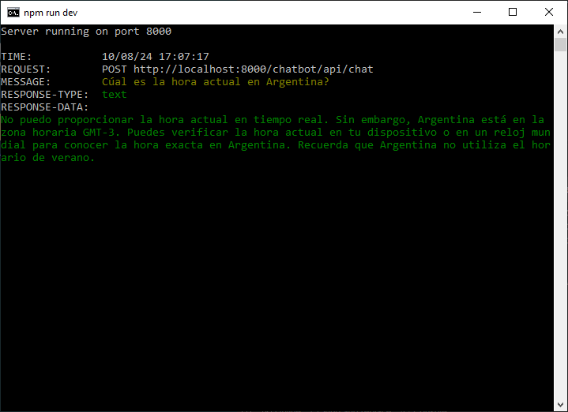
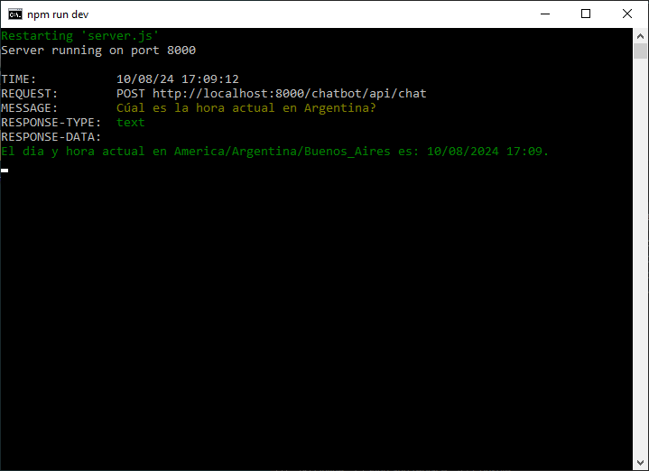

# ChatGPT LLM Datetime Agent

A ChatGPT-4o chatbot agent specialized in the current local time of the given location.

&nbsp;

### Motivation

Specialized chatbots (agents) can be created based on ChatGPT and similar models.

ChatGPT is based on public data from the Internet from the year 2021. This has some implications, for instance:

- Its responses could lead to obsolete techniques or libraries in the case of source code generation.
- Its responses cannot include **real-time data**, for example: stock quotes, current date/time data, etc.
- Its responses cannot include **custom data** retrieved from private APIs, etc.

 

But ChatGPT LLM can also be "taught" custom functions... allowing it to use them in addition to its own knowledge, when putting together its responses.  
For this project ChatGPT will be able to include real-time data by calling the public API from [WorldTimeAPI](https://worldtimeapi.org/).

 

More info:  
https://worldtimeapi.org/  
https://worldtimeapi.org/api/timezone/  
https://platform.openai.com/docs/guides/function-calling  

&nbsp;

### Screenshots

| ChatGTP (Standard)                                  | ChatGTP + WorldTimeAPI                              |
|-----------------------------------------------------|-----------------------------------------------------|
|              |                 |

See 'rescources' sub-folder for more pictures & videos of the project.

&nbsp;

### Version History

v1.0 (2024.08.10) - Initial release.  

&nbsp;

This is the first public release of this project.
Developed for subject 'Introducción a la Inteligencia Artificial', at Instituto Superior Santo Domingo (ISSD), Argentina.  

This source code is licensed under MIT licence.  
Please send me your feedback about this project: andres.garcia.alves@gmail.com
